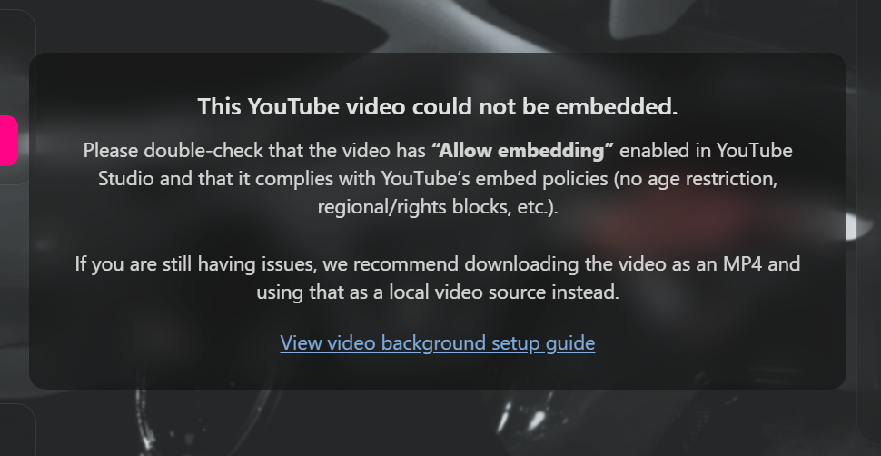

# 🎥 Background

Your loading screen background can be a **static image** or a **video**. If both are provided, the **video takes priority**.

> 📁 **Remember:** Place any images or videos inside the `html/assets/` folder so they load correctly.

!!! tip "Quicker in the Config Builder"
    The [Config Builder](https://loadingscreen.4zam.dev/builder.html) sets all of this under **Background** with a live preview, and [Build with AI](https://loadingscreen.4zam.dev/ai.html) can set it up from a plain description. Every field with its type and default is in the Config reference: [`backgroundImage`](config-reference.md#backgroundImage) and [`backgroundVideo`](config-reference.md#backgroundVideo) and [`videoAsAudio`](config-reference.md#videoAsAudio).

---

## 📷 Static Image Background

```json
"backgroundImage": "./assets/path/to/background.png",
"backgroundVideo": ""
```

!!! info "Static Image Notes"
    If you want to use a static image, leave `"backgroundVideo"` empty.  
    Even static images receive subtle ambient movement and lighting effects for depth.

---

## 🎬 Video Background (Local WebM)

```json
"backgroundVideo": "./assets/path/to/bg.webm"
```

!!! tip "Best Performance"
    Local video files load the fastest and avoid any YouTube embedding restrictions.

Supported formats:

- `.webm` (recommended)
- `.mp4`

Place your files inside:

```
html/assets/
```

---

## 📺 Video Background (YouTube)

```json
"backgroundVideo": "https://www.youtube.com/watch?v=abc123"
```

!!! info "Video Takes Priority"
    If `"backgroundVideo"` is set, the static `"backgroundImage"` will not be used.

---

## ⚠️ YouTube Embed Requirements & Error Handling { #youtube-embed-requirements-error-handling }

!!! success "Error 153 is fixed in v1.3.0"
    FiveM loads loading screens from `nui://`, which sends no Referer, so YouTube used to reject
    every embed with **"Error 153: video player configuration error"**. Since **v1.3.0**, YouTube
    links play in game through a small player page hosted at `loadingscreen.4zam.dev`, with sound,
    pause and volume working as usual. No setup is needed: paste a normal YouTube link.

YouTube videos still **must meet a few requirements** set by the video owner.  
If a video can't play, the loading screen automatically:

- Moves on to your **next video**, or to your **music**, within about 15 seconds, and  
- Shows a **notice** only if every video fails, falling back to your **static background image** with animation.

### Required YouTube Settings

Make sure your video has:

- **Embedding enabled**  
  *(YouTube Studio → Video → Settings → Permissions → “Allow embedding”)*
- **No age restriction**
- **No region/copyright blocks**
- **Public or unlisted visibility**

If any of these are missing, YouTube will block the embed request and the screen falls back as described above.

### How to Fix YouTube Videos That Won't Play { #how-to-fix-youtube-videos-that-wont-play }

1. Open **YouTube Studio**
2. Click **Content**
3. Select the video used in your config
4. Check the **Restrictions** column  
5. Fix any of the following issues:
    - Age-restricted → remove restriction  
    - Region blocked → allow all locations  
    - Embedding disabled → enable permissions  

The YouTube player page needs `loadingscreen.4zam.dev` to be reachable. If it isn't, YouTube backgrounds fall back to your next video or music within about 8 seconds. Local video files never depend on it.

---

### Final Fallback: Use a Local WebM (Recommended)

If your video **still refuses to embed**, even after correcting settings:

**Download the video and use a local `.webm` file instead.**  
This completely bypasses YouTube’s restrictions.

Place the file here:

```
html/assets/webm/background.webm
```

Then update your config:

```json
"backgroundVideo": "./assets/webm/background.webm"
```

This is the most reliable solution and prevents future YouTube policy issues.

---

## Automatic Fallback Behavior

If a YouTube or local video fails:

- The screen moves on to the **next video**, or to your **music**  
- If **every** video fails, a **notice** explains the issue with a **link to troubleshooting docs**  
- The background animates using your static `"backgroundImage"`  

This ensures the loading screen remains usable even during media failures.

???+ note "Preview"
    

---

## Video as the Audio Source

A background video can either **be the audio** (the player controls it: play/pause, scrub, volume) or play as a **silent, looping background** while the **music player** provides the audio. The `videoAsAudio` flag controls this:

```json
"backgroundVideo": "./assets/webm/ambient.webm",
"videoAsAudio": false
```

Field details: [`videoAsAudio`](config-reference.md#videoAsAudio) in the Config reference.

!!! info "Smart default"
    If you **don't** set `videoAsAudio`, the behavior depends on your config:

    - **With a `music` playlist** → the video is **muted** and the music plays. (Music wins.)
    - **Without any music** → the video **becomes the audio source**, so the screen is never silent.

    Set `videoAsAudio` explicitly to force either behavior regardless of the music playlist.

!!! tip "Pause the background video"
    In muted-ambient mode (`videoAsAudio: false`), a **Pause Video** button appears in the bottom-left controls so players can freeze or resume the looping background video.

---

## Multiple Background Videos (Playlist)

`backgroundVideo` accepts either a single URL **string** (the original shape) or an **array** of videos. With an array, the player gains forward/back controls to move between videos, and a playlist counter (e.g. `2 / 5`) appears.

```json
"backgroundVideo": [
  { "url": "./assets/webm/intro.webm",  "title": "Night Cruise", "subtitle": "The Vibe RP" },
  { "url": "https://www.youtube.com/watch?v=abc123", "title": "City Lights" },
  { "url": "./assets/webm/skyline.webm" }
]
```

Each entry takes `url`, plus an optional `title` and `subtitle`: see [`backgroundVideo`](config-reference.md#backgroundVideo) in the Config reference.

!!! info "Backwards compatible"
    A single string (`"backgroundVideo": "./assets/webm/bg.webm"`) still works exactly as before. The array form is only needed when you want more than one video.

!!! info "Default labels when title / subtitle are omitted"
    For any entry without metadata, the player falls back to your **watermark**:

    - `title` → your watermark name (`watermark.label.text`)
    - `subtitle` → your watermark subheading (`watermark.subHeading`)
    - cover art → your watermark logo (`watermark.logo`)

    Entries can also be plain URL strings (`["a.webm", "b.webm"]`): those use these fallbacks for every field.

!!! warning "When a video fails"
    If a video in the list fails to load, it is skipped to the next one. If **every** video fails, the screen falls back to the music player (or the animated image background).

!!! info "Muted-background playlists auto-cycle"
    In muted-ambient mode (`videoAsAudio: false`, with a music playlist), a multi-video list plays through automatically: each video plays in turn, then loops back to the first. There are no on-screen forward/back controls in this mode (those appear only when the video is the audio source), and a single video simply loops in place.

---

## Summary of Background Priority

| Priority | Type            | Notes                                      |
|---------|-----------------|---------------------------------------------|
| 1      | YouTube Video   | Must allow embedding; otherwise fallback   |
| 2️      | Local WEBM  | Fastest + most reliable                    |
| 3️      | Static Image    | Used when no video or video fails          |

---

## Where to Go Next

- Animate the **title** → [Title Animation](title-animation.md) page  
- Configure the **music player** → [Music Player](music-player.md) page  
- Back to the **Customization Overview** → [Overview](overview.md) page
- Video problems → [Troubleshooting](troubleshooting.md#video-tips) page
