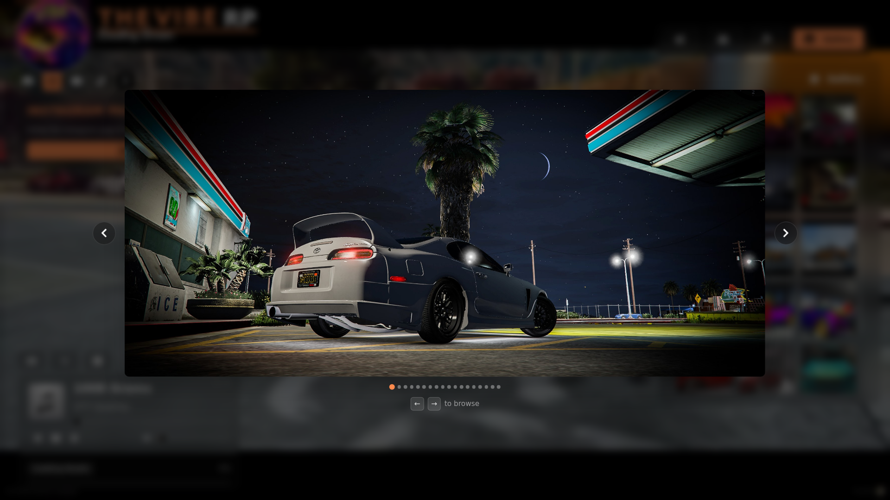

# 🖼️ Gallery Panel Configuration

The Gallery Panel appears on the loading screen and allows you to showcase images such as cars, team highlights, banners, or community events.

You can customize the images shown by editing the `gallery` array in your configuration file.

---

## JSON Structure

```json
"gallery": [
    { "path": "./assets/png/headshot.png" },
    { "path": "./assets/png/bluebmw.png" },
    { "path": "./assets/png/fmbanner.png" },
    { "path": "./assets/png/2gtrs.png" },
    { "path": "./assets/png/vibe.png" },
    { "path": "./assets/png/supra2.png" }
]
```

### Field Breakdown

| **Field** | **Description**                                                               |
| --------- | ----------------------------------------------------------------------------- |
| `path`    | The file path to your image asset (relative to your loading screen `assets/`) |

!!! info "Recommended Image Format"
    Use .png or .jpg images in landscape orientation for best visual balance.

!!! note "Aspect Ratio Tip"
    For a clean layout, try to keep all gallery images at a consistent resolution (e.g. 1280x720 or 1920x1080).

## Viewing Images (Lightbox)

Clicking any thumbnail opens the image in a full-size lightbox. From there you can move through the gallery:

- **On-screen arrows** — left/right arrows on the sides of the image jump to the previous/next picture.
- **Keyboard** — the **←** and **→** arrow keys navigate, and **Esc** closes the lightbox.

Navigation **wraps around**: going back from the first image shows the last, and forward from the last returns to the first.

!!! info "Single image"
    The navigation arrows only appear when the gallery has more than one image. No extra configuration is needed — navigation works over your existing `gallery` array.

???+ note "Lightbox Preview"
    <div style="display: flex; justify-content: center; margin: 1.5rem 0;">
        
    </div>

???+ note "Gallery Panel Preview"
    <div style="display: flex; justify-content: center; margin: 1.5rem 0;">
    <video src="./../media/mp4/GalleryDemo.mp4" autoplay muted playsinline loop style="max-width: 100%; border-radius: 12px;">
    </video>
    </div>

!!! warning "Automatic Gallery Tab Hiding"
    The gallery tab is automatically hidden if the gallery array is empty ([ ]) or omitted entirely from the config.
    To disable the gallery feature, simply remove the gallery entry or ensure the array contains no images.

---
