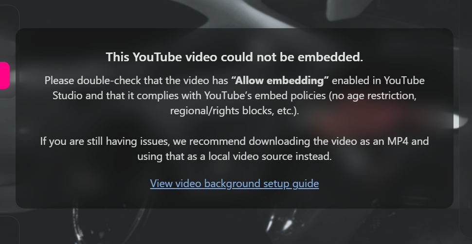

# 🎨 Customization Guide

You can customize the look and feel of the loading screen by editing the `config.json` file located in the `html` directory of the package.  
This guide walks you through the most important configuration options.

> 📁 **Remember:** Place any images, videos, or audio files inside the `html/assets/` folder to ensure they load correctly in the UI.

---

## Overall Theme Color

Customize the main highlight UI color:

```json
"selectedColor": "#ff007b",
```

!!! info "Color Format"
    Accepts both **hex** and **RGB** values.

---

## Background Options

You can use a **static image** or a **video** as your background.  
If both are provided, the **video always takes priority**.

---

## 📷 Static Image Background

```json
"backgroundImage": "./assets/path/to/background.png",
"backgroundVideo": ""
```

!!! info "Static Image Notes"
    If you want to use a static image, leave `"backgroundVideo"` empty.  
    Even static images receive subtle ambient movement and lighting effects for depth.

---

## 🎥 Video Background (Local WebM)

```json
"backgroundVideo": "./assets/path/to/bg.webm"
```

!!! tip "Best Performance"
    Local video files load the fastest and avoid any YouTube embedding restrictions.

Supported formats:

- `.webm` (recommended)

Place your files inside:

```
html/assets/
```

---

## 📺 Video Background (YouTube)

```json
"backgroundVideo": "https://www.youtube.com/watch?v=abc123"
```

!!! info "Video Takes Priority"
    If `"backgroundVideo"` is set, the static `"backgroundImage"` will not be used.

---

## ⚠️ YouTube Embed Requirements & Error Handling

YouTube videos **must meet several requirements** to play inside FiveM's Chromium-based UI.  
If the loading screen detects an embedding issue, it will automatically:

- Show a **graceful error modal**, and  
- Fall back to your **static background image** with animation.

### Required YouTube Settings

Make sure your video has:

- **Embedding enabled**  
  *(YouTube Studio → Video → Settings → Permissions → “Allow embedding”)*
- **No age restriction**
- **No region/copyright blocks**
- **Public or unlisted visibility**

If any of these are missing, YouTube will block the embed request, and a failure modal will appear.

### How to Fix YouTube Videos That Won't Play

1. Open **YouTube Studio**
2. Click **Content**
3. Select the video used in your config
4. Check the **Restrictions** column  
5. Fix any of the following issues:
    - Age-restricted → remove restriction  
    - Region blocked → allow all locations  
    - Embedding disabled → enable permissions  

The UI will automatically detect errors (Invalid Frame 153, blocked iframe, etc.) and show helpful guidance.

---

### Final Fallback: Use a Local WebM (Recommended)

If your video **still refuses to embed**, even after correcting settings:

**Download the video and use a local `.webm` file instead.**  
This completely bypasses YouTube’s restrictions.

Place the file here:

```
html/assets/webm/background.webm
```

Then update your config:

```json
"backgroundVideo": "./assets/webm/background.webm"
```

This is the most reliable solution and prevents future YouTube policy issues.

---

## Automatic Fallback Behavior

If your YouTube or local video fails:

- A **modal** explains the issue  
- A **link to troubleshooting docs** appears  
- The background animates using your static `"backgroundImage"`  

This ensures the loading screen remains usable even during media failures.

???+ note "Preview"
    

---

## Summary of Background Priority

| Priority | Type            | Notes                                      |
|---------|-----------------|---------------------------------------------|
| 1      | YouTube Video   | Must allow embedding; otherwise fallback   |
| 2️      | Local WEBM  | Fastest + most reliable                    |
| 3️      | Static Image    | Used when no video or video fails          |

---

## Example Configuration

```json
{
  "selectedColor": "#ff007b",
  "backgroundImage": "./assets/bg.jpg",
  "backgroundVideo": "https://www.youtube.com/watch?v=abc123"
}
```

---

## Where to Go Next

- Configure your **watermark** → [Watermark](watermark.md) page  
- Customize **social headers & custom icons** → [Social Headers](socials.md) page  
- Create formatted **rules** → [Rules Panel](rules.md) page  
- Add your **team panel** → [Team Panel](team.md) page  
- Build a **gallery grid** → [Gallery Grid](gallery.md) page
- Configure a **custom panel** → [Custom Panel](custom-panel.md) page
- Enable the **keyboard overlay** → [Keyboard Overlay](keyboard-overlay.md) page  
- Configure the **music player** → [Music Player](music-player.md) page  

---
