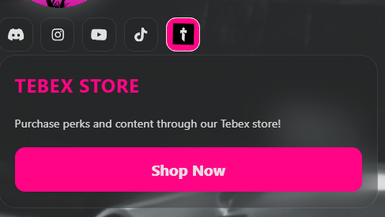

# 🧷 Social Header Configuration

You can customize the social header cards that appear at the top of the loading screen. These cards allow users to quickly join your Discord, visit your Instagram or check out other platforms.

!!! tip "Quicker in the Config Builder"
    The [Config Builder](https://loadingscreen.4zam.dev/builder.html) sets all of this under **Social Links** with a live preview, and [Build with AI](https://loadingscreen.4zam.dev/ai.html) can set it up from a plain description. Every field with its type and default is in the Config reference: [`socialHeaders`](config-reference.md#socialHeaders).

---

## JSON Structure

```json
"socialHeaders": [
    { 
        "type": "discord", 
        "cardLabel": "Discord Server", 
        "cardInfo": "Join the discord to keep up with the latest on the FiveM server!", 
        "link": "https://discord.gg/dbFChqBh5u", 
        "buttonLabel": "Join",
        "enabled": true 
    }
]
```

## Field Breakdown

Each card takes `type`, `cardLabel`, `cardInfo`, `link`, `buttonLabel` and `enabled`: types and details are in the [Config reference](config-reference.md#socialHeaders). The `link` opens when the card button is clicked. Leave `buttonLabel` empty to use the default "Join" text.

!!! info "Multiple Platforms Supported"
    You can include multiple social cards by adding more objects to the socialHeaders array.

## Supported `type` values

The built-in platforms plus `custom` (your own icon) are listed under `socialHeaders[].type` in the [Config reference](config-reference.md#socialHeaders).

!!! warning "Spelling Matters"
    The type value must be lowercase and spelled exactly as listed in the [Config reference](config-reference.md#socialHeaders) to display the correct icon.

???+ note "Social Media Card Preview"
    <div style="display: flex; justify-content: center; margin: 1.5rem 0;">
        <video 
            src="./../media/mp4/SocialDemo.mp4" 
            autoplay 
            muted 
            playsinline 
            loop 
            style="max-width: 100%; border-radius: 12px;">
        </video>
    </div>

## Custom Icon Support { #custom-icon-support }

You can use your own icon instead of the built-in ones by setting type to "custom" and providing an image path in the config.

### Example: Tebex / Store Icon

```json
"socialHeaders": [
    {
        "type": "discord",
        "cardLabel": "Discord Server",
        "cardInfo": "Join the discord to keep up with the latest on the FiveM server!",
        "link": "https://discord.gg/dbFChqBh5u",
        "buttonLabel": "Join",
        "enabled": true
    },
    {
        "type": "custom",
        "cardLabel": "Tebex Store",
        "cardInfo": "Purchase perks and content through our Tebex store!",
        "link": "https://your-tebex-link-here",
        "buttonLabel": "Shop Now",
        "enabled": true,

        "imagePath": "./assets/jpg/tebex.jpg",
        "imageWidth": "3vw",
        "imageHeight": "3vh"
    }
]
```

### Custom Icon Fields

- `imagePath`: your icon image, a URL or a path inside the resource. Needed for `custom`.
- `imageWidth` and `imageHeight`: optional, any valid CSS size (`px`, `vw`, `vh`, `%` and so on).

Types are in the [Config reference](config-reference.md#socialHeaders).

### Why `imageWidth` and `imageHeight` are exposed

Different icons will have different aspect ratios and visual weight.
Since this script cannot guarantee that every custom image will automatically fit perfectly inside the button, you, the server owner, have full control over the icon size:

- Use `imageWidth` and `imageHeight` to tweak how big the icon appears in the button
- If omitted, a default size will be used, but this might not look ideal for all assets
- This lets you adjust per-icon without editing the code

???+ note "Custom Tebex Icon Example Preview"
    

## Recommended Icon Formats

For best results:

- SVG (preferred)
    - Sharp at any size
    - Perfect for logos
    - Small file size

- PNG (transparent background preferred)
    - At least 256×256 or 512×512
    - Great for icons with soft edges or glow effects
    - Preserves transparency for cleaner UI visuals

- JPEG / JPG (supported but not ideal)
    - Works fine if your image does not require transparency
    - Useful for rectangular logos or photos
    - Should be high resolution to avoid blurring

Avoid

- Low-resolution PNG/JPEG images
- Icons with solid white/black background when transparency is needed
- Very wide or tall aspect-ratios that distort inside the social buttons

---
